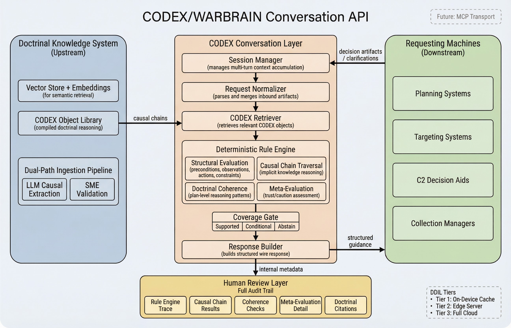

# CODEX/WARBRAIN Conversation Layer

Machine-to-machine doctrinal evaluation API implementing the CODEX Decision-Time Evaluation protocol. A deterministic rule engine evaluates structured decision artifacts against compiled CODEX objects and returns one of three outcomes -- **Supported**, **Conditional**, or **Abstain** -- with a per-response meta-evaluation that tells the consuming machine exactly why to trust or be cautious about the guidance.

No LLM sits in the critical evaluation path. Every evaluation is fully auditable, fully reproducible, and runs without network connectivity.



## Design Philosophy

Three tenets drive the design:

1. **Machines should never need to interpret natural language to act on a response.** Every response type -- guidance, clarification request, or abstention -- is fully structured, typed, and schema-validated. The requesting machine parses, validates, and acts without additional NLP.

2. **Explainability is preserved but separated into two tiers.** The wire response carries only what the machine needs to act: evaluation outcome, structured guidance actions, conditions, CODEX references, and a meta-evaluation with specific trust and caution factors. The full rule engine trace, causal chain evaluation results, internal confidence scores, and doctrinal citations are persisted internally for human review and audit.

3. **The system never fabricates guidance.** When doctrine does not cover a situation, the system abstains and explains why. Principled abstention is a design requirement, not a limitation.

## Architecture

The conversation layer is a Python/FastAPI service with the following pipeline:

**Session Manager** -- Tracks multi-turn exchanges with context accumulation across turns. Configurable inactivity timeout and maximum clarification depth.

**Request Normalizer** -- Parses inbound messages (decision artifacts or clarification responses), validates schemas, and merges with accumulated session context.

**CODEX Retriever** -- Abstracted interface to the upstream doctrinal knowledge store. Takes a normalized artifact, returns relevant CODEX objects. The MVP uses a mock implementation loading from a local JSON file. In production, the upstream team implements this interface against whatever storage and search system they build. The conversation layer is deliberately decoupled from the upstream implementation.

**Deterministic Rule Engine** -- The core evaluator, performing four layers of analysis:

- *Structural evaluation* -- Set operations and field comparisons: precondition verification, observation gap analysis, action alignment against CODEX allowed actions, constraint conflict detection, tradeoff identification.
- *Causal chain traversal* -- Walks IF/THEN/BECAUSE/UNLESS reasoning chains on each CODEX object. Checks whether each link's condition is evidenced in the artifact, propagates effects forward through the chain, and watches for exception conditions. Satisfied chains become trust factors; broken chains become caution factors with the specific break point identified.
- *Meta-evaluation* -- A structured trust assessment unique to each response. Specific, enumerated trust factors and caution factors grounded in the structural checks and chain results -- not generic disclaimers or opaque confidence scores.
- *Doctrinal coherence* -- Cross-cutting rules that evaluate whether the overall response aligns with how the Army reasons at a level above individual fields. Five initial rules: fires-maneuver integration (COH-001), reserve maintenance (COH-002), security element presence (COH-003), high-stakes constraint awareness (COH-004), and effects alignment (COH-005).

**Response Builder** -- Converts internal evaluation results into lean, schema-validated JSON responses. Only machine-actionable content rides on the wire.

**Human Review Logging** -- Every outbound evaluation is persisted with a full internal audit trail: internal confidence score, complete rule engine decision trace, causal chain evaluation, meta-evaluation with coherence results, retrieved CODEX object IDs, precondition validation, and doctrinal citations.

## Why a Deterministic Rule Engine

The original design placed an LLM in the critical evaluation path. Three problems led to replacing it:

- **Consistency.** The same artifact evaluated against the same doctrine must produce the same evaluation every time. An LLM does not guarantee this.
- **Auditability.** When a reviewer needs to understand why the system evaluated a COA as conditional, they need a decision trace, not a probability distribution. The rule engine produces a complete trace of every check, threshold, causal link, and coherence rule.
- **DDIL compatibility.** The rule engine runs on any device that can parse JSON and execute conditional logic. Pre-loaded CODEX objects plus the rule engine equals doctrinal reasoning at the tactical edge with zero connectivity.

The LLM still has a role at ingestion time (extracting causal chains from doctrinal text) and as an optional fallback for novel situations. It is deliberately excluded from the critical evaluation path.

## Quick Start

```bash
# Install dependencies
pip install -r requirements.txt

# Copy env file and configure
cp .env.example .env

# Run the server
uvicorn app.main:app --reload

# Run the demo (in a separate terminal)
python demo.py
```

The API will be available at `http://localhost:8000`. Interactive docs at `http://localhost:8000/docs`.

## API Endpoints

All endpoints are under `/v1/`:

| Method | Endpoint | Description |
|--------|----------|-------------|
| `POST` | `/v1/sessions` | Create a conversation session |
| `POST` | `/v1/sessions/{id}/messages` | Submit a decision artifact or clarification |
| `GET` | `/v1/sessions/{id}` | Get session with message history |
| `GET` | `/v1/sessions/{id}/messages/{msg_id}` | Get message with internal metadata |
| `PATCH` | `/v1/sessions/{id}` | Update session status |
| `GET` | `/v1/health` | Health check |

## Evaluation Outcomes

**Supported** -- All preconditions verified, all required observations confirmed, no broken causal chains, no unresolved structural conditions. The artifact is fully aligned with compiled doctrine. Zero caution factors.

**Conditional** -- Doctrine applies and guidance is available, but there are outstanding conditions: unverified preconditions, missing observations, broken causal chains, active tradeoffs, or coherence concerns. The machine gets guidance AND a checklist of what to resolve, with specific caution factors explaining why each condition matters.

**Abstain** -- Either the request is too sparse to evaluate (with structured clarification questions to improve it on the next turn) or the request falls outside the doctrinal corpus entirely. The system never fabricates guidance.

Each response also carries a doctrine coverage classification: **direct** (doctrine explicitly covers this situation), **analogous** (structurally similar doctrine used as basis), or **partial** (some aspects covered, gaps explicitly flagged).

## CODEX Object Schema

CODEX objects are the unit of compiled doctrinal reasoning -- not text chunks or embeddings, but structured representations containing:

- **Context envelope** -- echelon, phase, mission type, domain
- **Triggers** -- conditions that activate this doctrinal reasoning
- **Required observations** -- what the situation must confirm before doctrine applies with confidence
- **Allowed actions** -- doctrinally sanctioned actions with parameters and intended effects
- **Intended effects** -- what this doctrine, applied correctly, should achieve
- **Constraints** -- boundaries on action (ROE, civilian protection, coordination measures)
- **Tradeoffs** -- explicit capability tradeoff mappings
- **Measures** -- how you know if it worked
- **Provenance** -- doctrinal citations tracing every piece of guidance to source material
- **Causal chains** -- IF/THEN/BECAUSE/UNLESS reasoning patterns capturing the implicit logic behind actions, extracted by LLM at ingestion time and validated by SMEs

Every field has a default value, so CODEX objects can be populated incrementally. An object with only explicit fields still evaluates correctly; an object with full causal chains enables deeper evaluation.

## Implicit Knowledge: Two Tiers

**Tier 1: Action-level causal chains.** Structured reasoning patterns on each CODEX object capturing the WHY behind specific actions. Extracted from doctrine by LLM at ingestion, validated by SMEs, stored as structured data, evaluated deterministically at query time.

**Tier 2: Plan-level coherence rules.** Cross-cutting institutional reasoning patterns that evaluate whether the overall guidance aligns with how the Army thinks -- not tied to individual CODEX objects, but representing principles like fires-maneuver synchronization, reserve maintenance, and security element presence. Authored by SMEs, executed deterministically.

## Demo Scenarios

The demo script (`demo.py`) walks through five scenarios:

1. **Supported** -- Complete battalion-level area defense COA with all observations confirmed, all preconditions verified. Returns Supported with direct coverage, satisfied causal chains, passed coherence checks, zero caution factors.
2. **Conditional** -- Same context with unknown fire support and missing observations. Returns full guidance with specific caution factors for every outstanding condition.
3. **Abstain (sparse)** -- Bare-bones request with only artifact type and objective. System abstains: too little context to match.
4. **Abstain (no coverage)** -- Well-formed request outside doctrinal scope. System abstains cleanly with novel situation flag.
5. **Multi-turn** -- Sparse movement-to-contact request triggers clarification questions. Machine responds with structured answers. System re-evaluates with enriched context and delivers conditional guidance.

## Project Structure

```
├── app/
│   ├── main.py                 # FastAPI application entry point
│   ├── config.py               # Configuration (env vars)
│   ├── api/
│   │   ├── router.py           # API router (/v1/ prefix)
│   │   ├── messages.py         # Message submission endpoints
│   │   ├── sessions.py         # Session CRUD endpoints
│   │   └── health.py           # Health check
│   ├── interfaces/
│   │   ├── llm.py              # LLM provider interface (abstracted)
│   │   └── retriever.py        # CODEX retriever interface + mock impl
│   ├── models/
│   │   ├── schemas.py          # Pydantic request/response schemas
│   │   ├── database.py         # SQLAlchemy async models
│   │   └── codex_objects.py    # CODEX object schema (with causal chains)
│   └── services/
│       ├── evaluation.py       # Evaluation pipeline orchestrator
│       ├── normalizer.py       # Request normalization + context merge
│       ├── rule_engine.py      # Deterministic rule engine (core)
│       ├── response_builder.py # Wire response construction
│       └── session_service.py  # Session management
├── data/
│   └── sample_codex_objects.json  # Sample CODEX objects for mock retriever
├── tests/
├── demo.py                     # Demo script (5 scenarios)
├── requirements.txt
├── TECHNICAL_ROADMAP.md        # Limitations, enhancements, validation strategy
└── .env.example                # Environment variable template
```

## Configuration

Set via environment variables or `.env` file:

| Variable | Default | Description |
|----------|---------|-------------|
| `LLM_PROVIDER` | `mock` | LLM provider (`mock` or `openai`) |
| `CONFIDENCE_THRESHOLD` | `0.7` | Evaluation gate threshold |
| `MAX_CLARIFICATION_TURNS` | `5` | Max back-and-forth per session |
| `SESSION_TTL_SECONDS` | `1800` | Session inactivity timeout |
| `DATABASE_URL` | `sqlite+aiosqlite:///./warbrain.db` | Database connection string |

## Current Status

This is a **proof-of-concept / MVP** demonstrating the core architecture and evaluation logic.

- **Rule engine**: Fully functional with structural evaluation, causal chain traversal, meta-evaluation, and doctrinal coherence (5 rules)
- **Retriever**: Mock implementation loading from local JSON. Production implementation requires upstream team integration.
- **CODEX objects**: 3 sample objects (area defense, fire support coordination, movement to contact) with full causal chains
- **Persistence**: Async SQLite via SQLAlchemy. Upgradeable to PostgreSQL with no schema changes.
- **API**: Versioned at `/v1/`, all endpoints functional
- **Audit trail**: Complete internal logging of every evaluation decision

See [TECHNICAL_ROADMAP.md](TECHNICAL_ROADMAP.md) for current limitations, planned enhancements, and production validation strategy.
